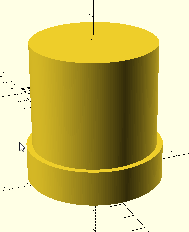

# double-ended-espresso-tamper

A 3D-printable dual tamper,with adjustable sizes for both ends!

## Overview

Dealing with more than one espresso maker with different sized filter baskets?
This double-ended tamper will let you print one object to handle both!

## Warning

**WARNING!** Most 3D Printable materials are *not* food safe; use this at your
own risk! You may be able to wrap this in plastic wrap, or coat it in food-safe
wax, etc.

## Details

This is created in - and can be edited in - [OpenSCAD](https://openscad.org/).
It also comes with [an STL file](double-ended-tamper-53mm-58mm-x30mm.stl) for a
**53mm** and **58mm** filter baskets tamper, which is also the default size.

### Thingiverse Customizer, etc

This object is set up to be customizable, with these adjustable properties:

| Property               | Purpose                       |
|------------------------|-------------------------------|
| `tamper_a_diameter_mm` | First tamper's diameter (mm)  |
| `tamper_b_diameter_mm` | Second tamper's diameter (mm) |
| `shaft_length_mm`      | Length of the handle between the two tampers |

The handle diameter is automatically based on the smaller of the two tampers.

